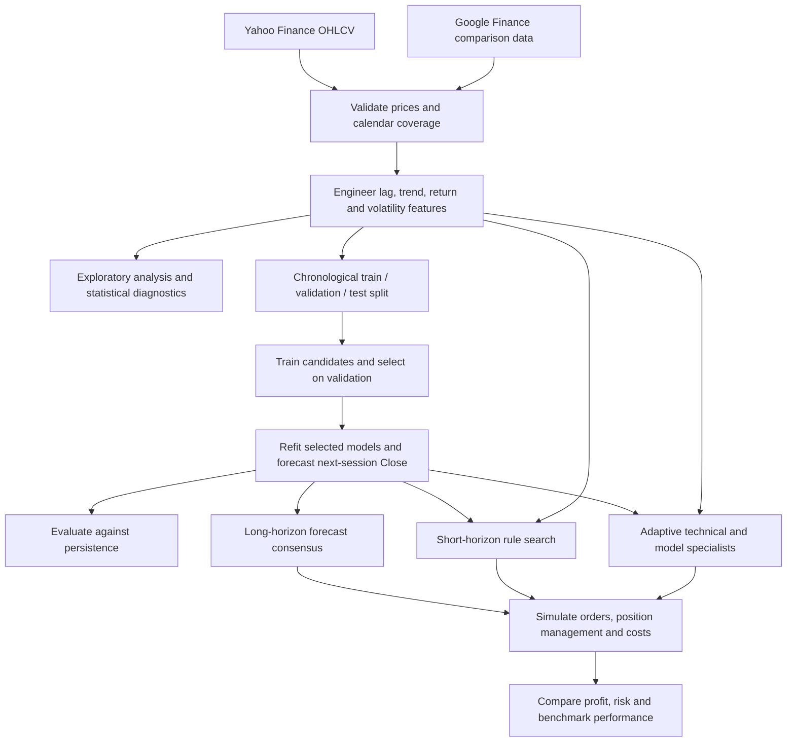
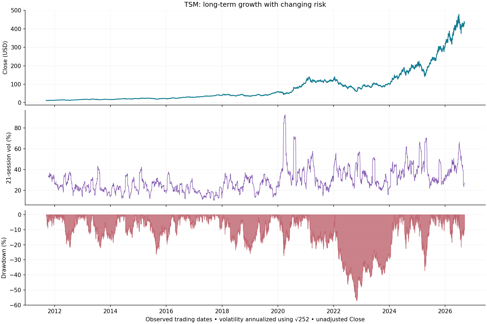
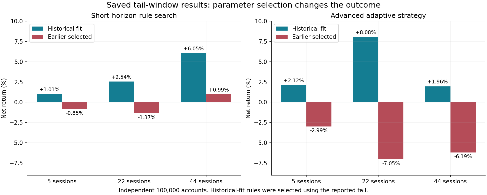

# TSMC Time-Series Forecasting and Trading

An end-to-end study of **TSMC’s US-listed shares (NYSE: TSM)**, combining market-data validation, exploratory analysis, feature engineering, six forecasting methods, and three trading strategies.

The project examines two questions: **How accurately can the next trading session’s closing price be forecast?** And **can those forecasts, combined with technical trading rules, produce returns after transaction costs?**

**Study period:** 12 September 2011–10 September 2026  
**Dataset:** 3,771 daily observations  
**Forecast horizon:** Next-session closing price  
**Trading evaluation:** Long-horizon simulation and rolling-length windows of 5, 22, and 44 observations

[Trading report](Trading/TSMC_All_Three_Strategies_Report_Final.html) · [EDA notebook](EDA/eda_tsmc.ipynb) · [EDA findings](EDA/TSMC_EDA_Findings.xlsx)

## Contents

- [Project overview](#project-overview)
- [Research workflow](#research-workflow)
- [Repository structure](#repository-structure)
- [Data and feature engineering](#data-and-feature-engineering)
- [Exploratory analysis](#exploratory-analysis)
- [Forecasting models](#forecasting-models)
- [Trading strategies](#trading-strategies)
- [Results](#results)
- [Getting started](#getting-started)
- [Reports](#reports)
- [Research limitations and future work](#research-limitations-and-future-work)

## Project overview

The research connects price forecasting with portfolio decisions. Statistical models establish a baseline, neural networks and gradient boosting test nonlinear relationships, and stacking evaluates whether combining forecasts improves accuracy. Three trading implementations then translate market information into entries, position sizes, exits, and portfolio returns.

The analysis covers:

- **Data quality:** Cross-source price validation, exchange-calendar coverage, missing values, and unusual observations.
- **Market behavior:** Trends, seasonality, return distributions, volatility, drawdowns, volume, and dependence.
- **Forecasting:** Chronological model selection and comparison against a persistence baseline.
- **Trading:** Forecast consensus, intraday rule selection, and an adaptive multi-strategy system.
- **Performance:** Net profit, benchmark returns, drawdown, costs, and sensitivity to strategy selection.

## Research workflow



Forecast accuracy and trading performance are evaluated separately. A smaller price error does not necessarily imply a tradable signal after costs.

## Repository structure

```text
.
├── README.md
├── validate.ipynb                         # Cross-source market-data validation
├── TSMC_Google_vs_Yahoo_Validation.xlsx
├── Data/
│   ├── google_data.csv
│   ├── tsm_yfinance_data.csv
│   └── TSMC_Master_Features_15Y.csv
├── Feature_Engineering/
│   └── features.ipynb
├── EDA/
│   ├── eda_tsmc.ipynb
│   └── TSMC_EDA_Findings.xlsx
├── notebook_models/
│   ├── arima.ipynb
│   ├── sarima.ipynb
│   ├── LSTM.ipynb
│   ├── Transformer.ipynb
│   ├── XGBoost.ipynb
│   └── Stacking.ipynb
├── models/                               # Trained models and preprocessing
│   └── <model_family>/<run_id>/
├── Trading/
│   ├── TSMC_Trading_Simulation_Professional_v3.ipynb
│   ├── TSMC_Short_Horizon_Weekly_Monthly_2Months.ipynb
│   ├── TSMC_Advanced_Multi_Strategy.ipynb
│   ├── TSMC_All_Three_Strategies_Report_Final.html
│   └── outputs/
│       ├── trading_outputs_1/
│       ├── short_horizon_outputs_v2/
│       └── advanced_report/
└── docs/
    └── assets/                           # README figures
```

## Data and feature engineering

The master dataset contains daily market observations and engineered predictors, with a date column and 37 numeric columns.

| Feature group | Variables | Role |
| --- | --- | --- |
| Market data | Open, High, Low, Close, Adj Close, Volume | Price history, activity, and execution prices |
| Returns and ranges | Simple/log returns, high–low range, open–close change | Daily price movement and candle structure |
| Lags | Price and return lags | Recent market history |
| Trend and momentum | Moving averages and multi-session momentum | Direction and trend strength |
| Volatility | Rolling volatility over 5, 10, and 20 sessions | Changing risk conditions |
| Calendar | Weekday, month, quarter, year | Calendar-pattern analysis |

Models predict the next observed session’s **unadjusted Close** using information available at the current close. Adjusted Close is excluded from forecasting inputs because point-in-time adjustment history is not documented.

Rolling indicators introduce an initial warm-up period. The data contains 241 warm-up missing cells across 24 derived features, with no internal missing values after those features become available. Market closures are not filled with synthetic prices, and unusual observations remain in the analysis.

## Exploratory analysis



*Price growth is accompanied by changing volatility and substantial drawdowns. Rolling volatility uses 21 sessions and is annualized by √252.*

The EDA examines calendar coverage, multiple time aggregations, price and return distributions, seasonal decomposition, volume, anomalies, correlations, autocorrelation, stationarity, and downside risk.

| Finding | Result | Research implication |
| --- | --- | --- |
| Long-term growth | Close rises from $11.94 to $428.03; price CAGR of 26.96% | Provides a rationale for testing trend participation |
| Substantial downside | Maximum closing-price drawdown of −57.14% | Highlights the importance of exposure and risk controls |
| Changing volatility | Annualized full-sample volatility of 31.91%; peak rolling estimate of 93.02% | Motivates volatility-sensitive position sizing |
| Heavy-tailed returns | Excess kurtosis of 3.97; largest daily loss of −14.03% | Extreme moves require explicit stress testing |
| Volatility clustering | Lag-1 squared-return autocorrelation of approximately +0.203 | Supports studying persistence in risk conditions |
| Weak directional dependence | Lag-1 return autocorrelation of approximately −0.090 | Directional signals require careful validation after costs |
| Limited calendar evidence | Weekday, month, and ISO-week screens do not pass the 5% threshold after multiple-testing adjustment | Calendar averages alone are insufficient trading signals |
| Unstable seasonal indices | January: 103.53; September: 97.71; only 5 of 12 months retain their direction across sample halves | Seasonality is descriptive and varies over time |
| Volume–range association | Same-session correlation of approximately +0.640 | Suggests useful liquidity and execution context |

The monthly seasonal index measures month-end price relative to a centered trend and is normalized to average 100. It describes historical seasonality; because the centered trend uses future observations, it cannot be used directly as a real-time predictor.

## Forecasting models

### Evaluation design

Models use a chronological split without random shuffling. Configurations are selected on validation data, then refitted on training and validation data before test evaluation.

| Partition | Samples | Forecast-origin dates | Target dates |
| --- | ---: | --- | --- |
| Training | 2,604 | 18 Nov 2011–25 Mar 2022 | 21 Nov 2011–28 Mar 2022 |
| Validation | 558 | 28 Mar 2022–14 Jun 2024 | 29 Mar 2022–17 Jun 2024 |
| Test | 559 | 17 Jun 2024–9 Sep 2026 | 18 Jun 2024–10 Sep 2026 |

Feature alignment yields 3,721 supervised samples. LSTM sequences require additional lookback history. ARIMA and SARIMA update their states as observations arrive, without re-estimating parameters at every step.

### Model comparison

RMSE is measured in price units. Improvement is relative to the persistence forecast: **tomorrow’s Close equals today’s Close**.

| Model | Configuration | Test RMSE | Improvement over persistence |
| --- | --- | ---: | ---: |
| Persistence | Current Close | 7.40127 | 0.0000% |
| ARIMA | Close-only, (0,1,0) | 7.40127 | 0.0000% |
| SARIMA | Close-only, (0,1,0) × (0,1,1,5) | 7.39913 | +0.0289% |
| LSTM | 20-session lookback, 64 hidden units, one layer | 7.39152 | +0.1317% |
| **FT-Transformer** | Feature-token attention and price correction | **7.38916** | **+0.1636%** |
| XGBoost | Eight features, depth 2, one boosting round | 7.40069 | +0.0079% |
| Stacking | LSTM + FT-Transformer + XGBoost; Ridge regression | 7.48115 | −1.0792% |

The FT-Transformer achieves the lowest test RMSE, although its improvement over persistence is small. LSTM and Transformer directional accuracy equals the 53.13% always-up baseline. These results distinguish accurate price-level forecasts from useful directional predictions.

Neural models predict corrections around the current price, and XGBoost predicts a dollar change added to the current Close. Stacking uses expanding out-of-fold predictions to train its meta-model. The Transformer operates across feature tokens rather than a sequence of trading sessions.

## Trading strategies

| Strategy | Decision process | Execution and risk management |
| --- | --- | --- |
| **Long-horizon consensus** | Combine five normalized forecasts with reliability weights, market-regime indicators, and bullish trend filters | Long-only; next-open orders; pyramiding; ATR trailing stops, profit locks, and trend exits |
| **Short-horizon rule search** | Evaluate 2,088 technical and forecast-based configurations; select an entry rule and bracket parameters | Long/short; next-open entry; ATR stop and target; close all positions by session end |
| **Advanced adaptive strategy** | Evaluate 756 configurations combining trend pullback, range reversion, price breakout, compression breakout, and model consensus | Whole-share risk sizing; volatility, gap, and volume limits; partial exits; trailing stops; holding limits; drawdown controls |

Five base models enter the long-horizon consensus. They also supply candidate signals to the short-horizon search and form one specialist within the advanced strategy. The short strategy’s historical winner uses a price breakout rule. Stacking does not participate in the three trading decision engines.

Weekly, monthly, and two-month results use the same daily trading engines over **5, 22, and 44 observations** respectively; they are not separate forecasting frequencies.

## Results

### Long-horizon performance

| Initial capital | Final portfolio value | **Net profit** | **Return** |
| ---: | ---: | ---: | ---: |
| 100,000.00 | 142,628.43 | **+42,628.43** | **+42.63%** |

The result comprises **42,356.80 in realized profit** from six completed positions and **271.63 in unrealized profit** on one open position. The equity series begins on 7 April 2025, with the final portfolio marked on 10 September 2026. Despite the notebook’s “yearly” label, this is not a single calendar-year result.

### Weekly, monthly, and two-month performance

Each account starts at **100,000**. Overlapping windows are evaluated independently, so their profits should not be added together.

| Window | Observations | Evaluation period |
| --- | ---: | --- |
| Weekly | 5 | 3–10 September 2026 |
| Monthly | 22 | 11 August–10 September 2026 |
| Two months | 44 | 10 July–10 September 2026 |

Two selection methods are reported:

- **Historical fit:** Parameters are selected using the final windows being evaluated.
- **Earlier selected:** Parameters are chosen on preceding development and validation observations before evaluating the final window.

| Strategy | Selection | Weekly net profit | Monthly net profit | Two-month net profit |
| --- | --- | ---: | ---: | ---: |
| Short horizon | Historical fit | **+1,009.81** | **+2,541.14** | **+6,052.88** |
| Short horizon | Earlier selected | −852.45 | −1,371.92 | +988.40 |
| Advanced | Historical fit | **+2,120.50** | **+8,076.11** | **+1,961.40** |
| Advanced | Earlier selected | −2,994.17 | −7,049.34 | −6,188.57 |



*Returns include modeled transaction costs. Historical-fit profits and earlier-selected outcomes are shown together to expose sensitivity to parameter selection.*

The advanced historical fit produces the largest monthly gain, while the short historical fit produces the larger two-month gain. Both earlier-selected monthly strategies lose money, indicating that favorable fitted results do not establish a repeatable trading advantage.

Annual and short-horizon simulations charge 10 basis points per side. The advanced engine models commissions, base slippage, participation impact, and minimum fees. Short positions also incur borrowing costs.

**Profit figures are simulation units.** Market prices are USD, while the annual workbook uses a ₹ label without an implemented currency conversion; numerical results are therefore reported without assigning a currency.

## Getting started

### Environment setup

Run these commands from the repository root in Windows PowerShell:

```powershell
python -m venv .venv
.\.venv\Scripts\python.exe -m pip install --upgrade pip
.\.venv\Scripts\python.exe -m pip install jupyterlab ipykernel numpy pandas scipy matplotlib plotly scikit-learn statsmodels joblib openpyxl pandas-market-calendars torch xgboost
.\.venv\Scripts\python.exe -m jupyter lab
```

Select the environment’s Python kernel and execute notebook cells in order. Package versions are not pinned; consult the model-run manifests when reproducing an existing experiment.

**Hardware:** Statistical models and EDA run on CPU. LSTM and Transformer support CUDA/CPU selection. The current XGBoost and Stacking training notebooks explicitly require CUDA; CPU execution requires updating their device configuration and checks.

### Paths and model files

Before running notebooks:

- Set input paths to the files in `Data/` and replace machine-specific absolute paths.
- Check the trading notebooks’ `ROOT`, `DATASET`, and `PATHS` settings, including model and preprocessing locations.
- Set `OUTPUT_DIR` explicitly if results should be written under `Trading/outputs/`; current notebook defaults differ from this archive layout.
- Set the EDA `ANALYSIS_END` cutoff when restricting exploration to a training period.

The `models/` and `outputs/` directories are excluded by `.gitignore`. A fresh clone needs the trained model files supplied separately or rebuilt through the training notebooks before trading inference can run.

### Execution order

| Step | Notebook | Purpose |
| --- | --- | --- |
| 1 | [validate.ipynb](validate.ipynb) | Compare Google and Yahoo market data |
| 2 | [features.ipynb](Feature_Engineering/features.ipynb) | Build the master feature dataset |
| 3 | [eda_tsmc.ipynb](EDA/eda_tsmc.ipynb) | Explore distributions, dependence, seasonality, and risk |
| 4 | Base-model notebooks in `notebook_models/` | Train and evaluate ARIMA, SARIMA, LSTM, Transformer, and XGBoost |
| 5 | [Stacking.ipynb](notebook_models/Stacking.ipynb) | Evaluate the forecast ensemble |
| 6 | [Long-horizon](Trading/TSMC_Trading_Simulation_Professional_v3.ipynb), [short-horizon](Trading/TSMC_Short_Horizon_Weekly_Monthly_2Months.ipynb), or [advanced](Trading/TSMC_Advanced_Multi_Strategy.ipynb) notebook | Simulate the corresponding trading strategy |

Feature engineering and model training can be skipped when using the existing master dataset and matching trained models. Preserve feature order, scalers, forecast-origin dates, target reconstruction, and selected parameters when reproducing inference.

## Reports

| Report | Coverage |
| --- | --- |
| [Integrated trading report](Trading/TSMC_All_Three_Strategies_Report_Final.html) | All three pipelines, model training, profit comparisons, interactive charts, operational flowcharts, and detailed execution rules |
| [EDA findings workbook](EDA/TSMC_EDA_Findings.xlsx) | Eight sheets covering market behavior, seasonality, dependence, data quality, strategy implications, and candidate factors |
| [Long-horizon results](Trading/outputs/trading_outputs_1/TSMC_Trading_Pipeline_Strategy_Results_Final.xlsx) | Portfolio performance and completed-position accounting, including pyramid entries |
| [Short-horizon summary](Trading/outputs/short_horizon_outputs_v2/window_summary.csv) | Six runs across three windows and two selection methods |
| [Advanced results](Trading/outputs/advanced_report/TSMC_Advanced_Report.xlsx) | Trades, executions, daily accounts, selected rules, and cost sensitivity |

Open the HTML report in a browser to use its interactive charts and window controls. Reports can be reviewed without rerunning the simulations.

## Research limitations and future work

Historical-fit strategies use the reported evaluation windows for parameter selection. Their results must be interpreted alongside the earlier-selected comparisons. The historical test period has also been examined during project development, so it is not a newly untouched evaluation set.

The long-horizon implementation has known forecast-reconstruction and equity-timing inconsistencies. Its corrected workbook reconciles pyramid trade accounting but does not resolve those implementation issues. Daily OHLC simulations also cannot fully represent intraday order sequence, execution quality, or short availability. Comparisons should use matching dates, capital, costs, and terminal-position conventions.

Further work should prioritize:

- **Walk-forward evaluation:** Freeze configurations before each evaluation window and measure stability across market regimes.
- **Model contribution:** Compare price-only, forecast-only, and combined strategies under the same execution assumptions.
- **Risk and activity factors:** Test volatility-regime ratios, downside volatility, normalized trend distance, and relative volume/range interactions.
- **Additional market context:** Evaluate sector-relative returns and earnings-related information with point-in-time data.
- **Execution robustness:** Stress transaction costs, slippage, borrowing assumptions, and trade-level concentration.

*Historical simulation results do not establish future profitability.*
